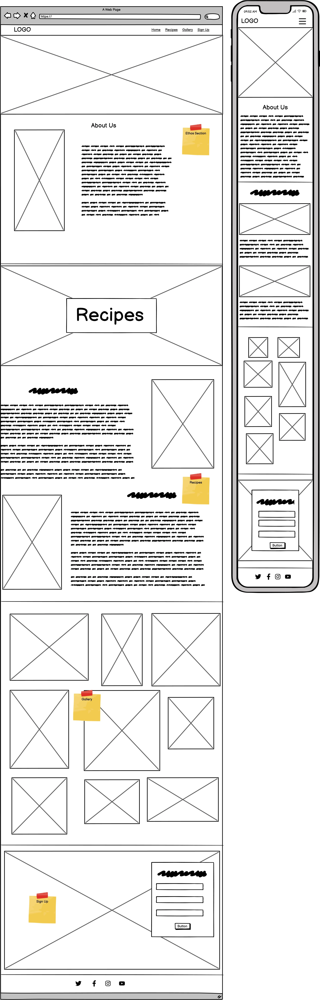
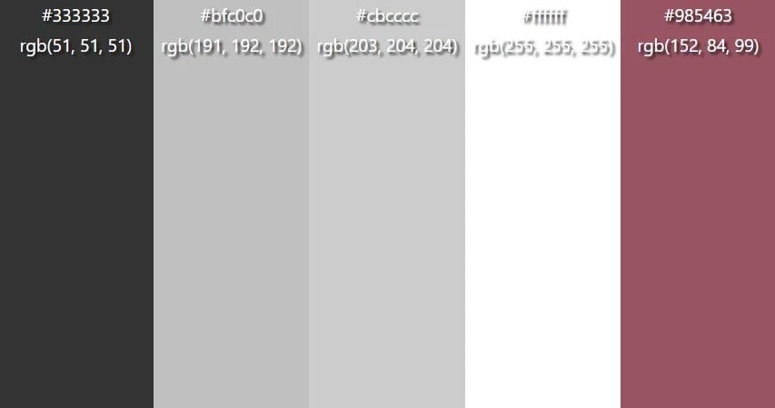

# Noodlelicious Responsive Website

# About
This is a static website project about a new recipe website called [Noodlelicious](URL), this website is all about NOODLES. The purpose for this website is to bring people different types of recipes that can be for anyone and everyone. 

Core Purpose:
- to bring people happiness through noodle dishes
- provide recipes that can be for any type of dietary requirements
- provide quick and easy recipes
- bring people together through noodles

The website is built using HTML and CSS as a Milestone Project#1 for the Code Institute's Full Stack Developer course.

[The live website is available here](URL)

# Wireframes

# Structure

## Home Page

- Allows users to read a little bit Noodlelicious.
    #### User Goal:
    >   - Find out what Noodlelicious is all about.
    >   - Understand what the website is about.
    >   - Make our visitors smile with some quirky quotes about noodles.
    #### Website Goal:
    >   - To show our visitors what we do and why we do it.

## Recipes

- Allows the user to see some potetntial dishes that they would like to try
    #### User Goal:
    >   - Check out two recipes to try out and see whether they are intrested in joing us for some more.
    #### Website Goal:
    >   - To show our visitors that noodles don't have to be basic to be quick.

## Gallery

- Allows the user to see hwo incredible noodle dishes look.
    #### User Goal:
    >   - Get a teaser as to what can be made quick and easy in their kitchen.
    >   - To see whether some of the dishes is something that they are looking for.
    #### Website Goal:
    >   - To show our visitors that noodles don't have to be basic to be quick.

## Sign Up

- Allows the user to join for more recipes.
    #### User Goal:
    >   - Join our website for more recipes and get excited for new recipe releases.
    #### Website Goal:
    >   - Easy way to get our visitors to sign up for more of our delicious dishes.

# UX Design
## User stories
### As a **first time user**

- I want to freely explore the website and find what I am looking for.
- I want to understand the main purpose for the website.
- I want to try out the recipes provided as a teaser.
- I want to be happy afer my first experiance with the website.
- Be able to explore the website on different type of devices.

### As a **returning** and a **frequent user**

- I want to join the community for more delicious recipes.
- I want to wait and see what other recipes will be added to the website.
- I want to see new updates on the website.
- I want to tell my friends about this recipe website so that they can join the community.
- Be able to explore the website on different type of devices.

# Design

As a recipe website we want to go explore the pages for the recipes but we also want to make sure that the website itself is visibly pleasant. At the same time I do not want the webisite to be too overwhelming. Hence why teh website is more of a simple design with darker and lighter colours. 

## Colours used

   > #BFC0C0 - Background Colour for Home Page and the NavBar
   > #CBCCCC - Background Colour for the Recipes and Gallery page.
   > #985463 - Hover over colour for Nav links and Brand name.
   > #333333 - For Brand name and Nav links
   > #FFFFFF - Text Colour

# Fonts used 

Noto Sans Tirhuta - Used across the website.

Roboto:ital - Used for Quotes in the Home Page, which gives the visial effect of a "quote".

# Images

Images in this project has been sourced from [Unsplash](https://unsplash.com) and [Pexels](https://www.pexels.com). These photos were selected as they fitted very well to the simple design of the website.

## Navbar hover effect 

When hovering over the Nav Link with the mouse, you can see a subtle change of colour which is #985463. This colour is also the colour of the bowl of the hero image.

